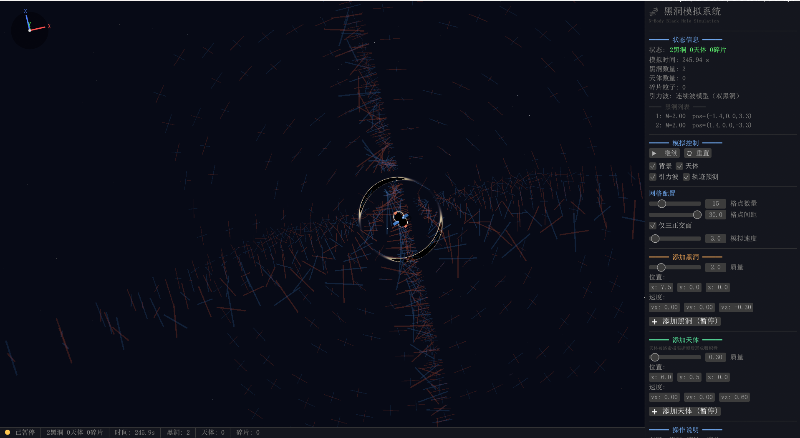

[English Version](README.md)

---
# 黑洞模拟器 🌌

一个基于 Rust 和 WGPU 的实时 3D 黑洞模拟器，包含引力波辐射、轨道旋进、潮汐撕裂等物理现象的可视化。



## 功能特性

- **实时 N 体模拟**：牛顿引力 + 2.5PN 后牛顿修正
- **引力波辐射反作用力** (Peters 1964)：双黑洞旋进 → plunge → 合并
- **Schwarzschild 时空扭曲**：Tendex 线可视化潮汐张量（ribbon 渲染，强度控制线宽和透明度）
- **三正交面模式**：仅显示 XY/YZ/XZ 中心面，提供更清晰的潮汐场横截面视图
- **双黑洞光子球变形**：伴星扰动导致光子球非球形
- **潮汐撕裂与事件视界吸收**：基于 Hills 质量的分支判断
- **引力波推迟传播**：辐射场以光速 c 传播，近场瞬时
- **轨迹预测**：可视化黑洞/天体的未来路径（含辐射阻力）
- **实例化渲染**：高效的轨迹与碎片可视化

## 物理理论

### 1. Tendex 线：时空曲率可视化

采用 **Tendex 线**方法可视化时空曲率，基于 Owen et al. (2011, arXiv:1012.4869)。

曲率张量的"电"部分 $E_{jk}$ 描述潮汐拉伸/压缩效应。在牛顿极限下：

$$
E_{jk} = \sum_i \frac{GM_i}{r_i^3} \left( 3 n_j n_k - \delta_{jk} \right)
$$

其中 $\mathbf{n} = \mathbf{r}/r$ 是从质量源指向场点的单位向量。

在每个空间采样点，计算 $E_{jk}$ 的三个特征值和特征向量：
- **红色线**：正特征值方向（潮汐**拉伸**）
- **蓝色线**：负特征值方向（潮汐**压缩**）
- 线长：固定为 $\frac{2}{3} \times \text{grid spacing}$（每侧伸出 1/3，相邻格点间留 1/3 空隙）
- 线宽与不透明度：由 $\sqrt{|\lambda|}$（强度）调制，潮汐力越强则线越粗、越亮

由于 $E_{jk}$ 是无迹的（ $\text{tr}(E) = 0$），三个特征值之和为零，拉伸和压缩方向互补。

**渲染方式**：线段渲染为面向相机的四边形 ribbon（TriangleList 拓扑，每条线 2 三角形 = 6 顶点），强度同时驱动厚度（基准的 $0.2\times$ ~ $1.5\times$ ）和不透明度（ $0$ ~ $0.75$ ）。

**三正交面模式**：可切换为仅显示三个中心正交面（XY、YZ、XZ）上的格点，而非完整 3D 体积，提供更清晰的横截面视图。网格中心跟随所有黑洞的质量加权质心，平滑过渡（每帧响应 0.15，约 7 帧达到 95%）。

### 2. 引力波辐射反作用力 (Peters 1964)

双星系统因引力波辐射损失轨道能量，导致旋进 (inspiral) 并最终合并。基于 Peters (1964) 经典公式：

**能量损失率**：

$$
\frac{dE}{dt} = -\frac{32}{5} \frac{G^4 \mu^2 M^3}{c^5 a^5}
$$

**半长轴变化率**：

$$
\frac{da}{dt} = -\frac{64}{5} \frac{G^3 \mu M^2}{c^5 a^3}
$$

**等效相对运动阻力加速度**（自然单位制 G=c=1）：

$$
\mathbf{a}_{\text{rad}} = -\frac{32}{5} \frac{\mu M^2}{r^4} \mathbf{v}_{\text{rel}}
$$

拆分到两体（质心系，伽利略变换下加速度不变）：

$$
\mathbf{a}_i = +\frac{32}{5} \frac{m_i m_j^2}{r^4} \mathbf{v}_{\text{rel}}
$$

$$
\mathbf{a}_j = -\frac{32}{5} \frac{m_i^2 m_j}{r^4} \mathbf{v}_{\text{rel}}
$$

其中 $\mu = m_i m_j / (m_i + m_j)$ 为约化质量， $M = m_i + m_j$ 为总质量， $r$ 为两体间距， $\mathbf{v}_{\text{rel}} = \mathbf{v}_j - \mathbf{v}_i$ 为相对速度。

**应用范围**：黑洞对、天体-黑洞对、碎片-黑洞对均应用此公式。

**Plunge 阶段增强**：当 $r < 3M$ 时（已过 ISCO），线性增强反作用力系数至最高 3 倍，模拟近合并阶段的非线性效应。

### 3. 黑洞合并判据：ISCO

双黑洞旋进在 **ISCO (Innermost Stable Circular Orbit)** 处结束，进入快速 plunge 阶段。

**ISCO 判据** (Blanchet & Iyer 2003, 3PN)：

$$
C_{\text{ISCO}}^{3\text{PN}} = 1 - 6x + 14\nu x^2 + \nu\left[\frac{397}{2} - \frac{123}{16}\pi^2 - 14\nu\right] x^3 = 0
$$

其中 $x = (G M \Omega / c^3)^{2/3}$ 为 PN 参数， $\nu = \mu/M$ 为对称质量比。

- 试验粒子极限 ($\nu \to 0$): $r_{\text{ISCO}} = 6GM/c^2 = 3(r_{s1}+r_{s2})$
- 等质量 ($\nu = 1/4$)：数值相对论给出 $r_{\text{ISCO}} \approx 5M$

**本模拟的合并条件**： $r < 0.5(r_{s1}+r_{s2})$（视界重叠 50%）

物理上 ISCO ≈ 3(r_{s1}+r_{s2}) 是 inspiral 终点，此处继续 plunge 至视界显著重叠。在真实 GR 中，公共视界在视界接触前已形成；本模拟为可视化目的延迟合并触发，让两个黑洞相互穿透、视觉重叠一段时间后再合并，体现质心点状特性。

**质量亏损**：合并后新黑洞质量为 $0.95 \times (m_1 + m_2)$，5% 质量以引力波形式辐射（Peters 公式预测值）。

### 4. 光子球变形（双黑洞）

孤立 Schwarzschild 黑洞的光子球半径和临界碰撞参数：

$$
r_{\text{ph}} = \frac{3GM}{c^2} = \frac{3}{2} r_s, \quad b_c = 3\sqrt{3} \frac{GM}{c^2} \approx 5.196 M
$$

**伴星扰动** (Erdl & Schneider 1993; Patil et al. 2016 arXiv:1610.04863; Cunha et al. 2018 arXiv:1805.03798)：

设主黑洞质量 $M$，伴星质量 $M'$ 位于距离 $D$、方向 $\hat{n}$。在弱扰动极限 ($D \gtrsim 10M$)，临界碰撞参数变为：

$$
b_c \approx 3\sqrt{3} M \left( 1 + \delta_{\text{mono}} + \delta_{\text{tidal}} \right)
$$

**单极扰动**（整体压缩）：

$$
\delta_{\text{mono}} = -\kappa_1 \frac{M'}{D}
$$

**四极潮汐扰动**（角度相关变形）：

$$
\delta_{\text{tidal}} = \kappa_2 \frac{M'}{M} \left(\frac{M}{D}\right)^2 P_2(\cos\theta)
$$

其中 $P_2(\cos\theta) = \frac{1}{2}(3\cos^2\theta - 1)$ 为二阶勒让德多项式， $\theta$ 为光线方向与伴星方向夹角。

**标定常数**： $\kappa_1 = 2$,  $\kappa_2 = 5$（弱场近似， $D \gtrsim 10M$ 时误差 < 几个百分点）。

**物理效应**：光子球朝伴星方向拉伸、背向压缩；当 $D$ 减小到某阈值时两个光子球合并并消失。

### 5. 引力波传播速度与推迟时间

**标准 GR 结果**：引力波严格以光速 $c$ 传播 (Einstein 1916, 1918)。波动方程：

$$
\square h_{\mu\nu} = -\frac{16\pi G}{c^4} T_{\mu\nu}, \quad \square = -\partial_t^2 + c^2 \nabla^2
$$

**观测约束** (GW170817/GRB 170817A, Abbott et al. 2017)：

$$
-3 \times 10^{-15} \leq \frac{v_{\text{gw}} - c}{c} \leq +7 \times 10^{-16}
$$

**推迟时间** (Blanchet 2014, Eq. 219)：

$$
t_{\text{ret}} = t_{\text{obs}} - \frac{|\mathbf{x}_{\text{obs}} - \mathbf{x}_{\text{source}}|}{c}
$$

辐射场在观测点 $(t, \mathbf{x})$ 处由源在 $t_{\text{ret}}$ 时刻的状态决定：

$$
h_{ij}^{\text{TT}}(t, \mathbf{x}) = \frac{2G}{c^4 R} \Lambda_{ij,kl}(\hat{N}) \frac{d^2 I_{kl}}{dt^2}(t_{\text{ret}})
$$

**近场 vs 辐射场** (2.5PN 展开结构)：

| 分量 | 距离依赖 | 传播性质 |
|------|----------|----------|
| 近场（Newtonian-like） | $\propto 1/r^2, 1/r^3$ | 牛顿极限下瞬时（PN 0 阶项） |
| 辐射（gravitational wave） | $\propto 1/r$ | 严格以 $c$ 传播 |

本模拟中：
- 牛顿潮汐场（Tendex 静态部分）使用瞬时位置计算（PN 0 阶）
- 引力波辐射场使用推迟时间 $t_{\text{ret}} = t - r/c$
- `WAVE_SPEED = c = 1`（自然单位）
- 网格特征值时间平滑系数 0.3，近似 PN 尾项 (tail, $\propto 1/c^2$) 的 hereditary 效应

### 6. 潮汐撕裂与事件视界吸收

**洛希极限** (Rees 1988, Hills 1975)：

$$
d_{\text{Roche}} = R_{\text{body}} \left( \frac{2 M_{\text{bh}}}{M_{\text{body}}} \right)^{1/3}
$$

**撕裂发生于视界外的条件**： $d_{\text{Roche}} > r_s = 2GM_{\text{bh}}/c^2$

等价为密度判据：

$$
\rho_{\text{body}} < \rho_{\text{BH}} = \frac{3 M_{\text{bh}}}{4\pi r_s^3} = \frac{3 c^6}{32\pi G^3 M_{\text{bh}}^2}
$$

**Hills 质量** $M_H$：对太阳型恒星 ($M_\odot, R_\odot$)：

$$
M_H \approx 1.08 \times 10^8 M_\odot \quad \text{(Schwarzschild)}
$$

- $M_{\text{bh}} < M_H$：太阳型恒星在视界外被撕裂（产生潮汐撕裂事件 TDE）
- $M_{\text{bh}} > M_H$：恒星整体越过视界被吞噬

**本模拟的分支判断**：
- 若 $d_{\text{Roche}} > r_s$（大天体 / 低密度）：走 Roche 撕裂路径，产生 60 个碎片粒子形成绕黑洞的吸积盘
- 若 $d_{\text{Roche}} < r_s$（致密天体如中子星、白矮星）：直接吸收

**碎片吸积盘形成**：天体被潮汐撕裂后，碎片在黑洞周围形成顺行吸积盘，以黑洞为中心，轨道半径 ≥ 1.5 × ISCO 半径（确保碎片在视界外生成，即使原天体已在视界内）。粒子遵循开普勒轨道速度，通过引力波辐射反作用力逐渐旋进。

### 7. 引力波双极化模式

实现 plus (+) 和 cross (×) 两种极化模式 (Maggiore 2008)：

$$
h_+ = h_0 \cdot \frac{1 + \cos^2\iota}{2} \cdot \cos(\Phi)
$$
$$
h_\times = h_0 \cdot \cos\iota \cdot \sin(\Phi)
$$

其中 $\iota$ 为观测者相对于轨道平面的倾角， $\Phi$ 为引力波相位。

**Chirp 质量**：

$$
M_c = \frac{(m_1 m_2)^{3/5}}{(m_1 + m_2)^{1/5}}, \quad h_0 = \frac{4 M_c^{5/3} \omega^{2/3}}{D}
$$

**TT 规范应变张量**（含极化角 $\psi$ 旋转）：

$$
h_{\theta\theta} = h_+ \cos 2\psi - h_\times \sin 2\psi
$$
$$
h_{\phi\phi} = -h_+ \cos 2\psi - h_\times \sin 2\psi
$$
$$
h_{\theta\phi} = h_+ \sin 2\psi + h_\times \cos 2\psi
$$

### 8. 线性化引力与叠加原理

$$
g_{\mu\nu} = \eta_{\mu\nu} + h_{\mu\nu}, \quad |h_{\mu\nu}| \ll 1
$$

在弱场极限下，多个源的曲率张量**线性叠加**：

$$
E_{jk}^{\text{total}} = \sum_{i=1}^{N_{\text{bodies}}} E_{jk}^{(i)} + E_{jk}^{\text{GW}}
$$

所有质量源（黑洞和普通天体）均产生潮汐效应，与引力波动态振荡叠加。

## 代码结构

```
src/
├── main.rs              # 应用入口，事件循环，ApplicationHandler
├── ui.rs                # egui 面板，坐标轴 gizmo
├── camera.rs            # 相机控制和透视投影
├── geometry.rs          # 球体/圆环几何体生成
├── physics/
│   ├── mod.rs           # Simulation 结构体，gw_radiation_reaction (Peters 公式)
│   ├── grid.rs          # Tendex 线：潮汐张量计算和特征分解
│   ├── collision.rs     # 黑洞合并 (ISCO)，视界吸收 (Hills)，洛希撕裂
│   └── trajectory.rs    # 轨迹预测（含辐射阻力）
└── renderer/
    ├── mod.rs           # Renderer 结构体，render 方法
    ├── types.rs         # 顶点/Uniform 结构体，常量
    ├── shaders.rs       # WGSL 着色器（含光子球变形）
    └── pipeline.rs      # 渲染管线和缓冲区创建
```

### 关键模块

- **[physics/mod.rs](src/physics/mod.rs)** - 核心物理：
  - `gw_radiation_reaction()` - Peters 1964 公式实现，含 plunge 阶段增强
  - `update_black_holes/bodies/debris()` - 三类天体的引力 + 辐射阻力更新

- **[physics/grid.rs](src/physics/grid.rs)** - Tendex 线时空曲率可视化：
  - `compute_tidal_tensor()` - 计算潮汐张量 $E_{jk}$（含引力波推迟贡献）
  - `update_grid_points()` - 特征分解 + 时间平滑（近似 PN 尾项）
  - `get_tendex_render_data()` - 生成面向相机的四边形 ribbon 顶点（强度驱动线宽和不透明度，支持三平面模式）

- **[physics/collision.rs](src/physics/collision.rs)** - 碰撞与演化：
  - `check_mergers()` - 基于 ISCO 的合并判据
  - `check_event_horizon_absorption()` - Hills 质量判断：撕裂 vs 吸收
  - `check_roche_disruption()` - 洛希极限撕裂产生吸积盘
  - `check_body_collisions()` - 基于 Q*_D 标度律的天体碰撞碎裂

- **[renderer/shaders.rs](src/renderer/shaders.rs)** - WGSL 着色器：
  - `perturbed_photon_sphere()` - 光子球变形（伴星扰动）
  - `compute_lensed_direction()` - 引力透镜光线偏折
  - `star_field()` - 程序化星空（含银河带、星云）

## 构建和运行

### 桌面版

```bash
# 优化构建
cargo build --release

# 运行
cargo run --release
```

### Web 版 (WebAssembly)

```bash
# 安装 wasm32 编译目标
rustup target add wasm32-unknown-unknown

# 安装 wasm-bindgen-cli
cargo install wasm-bindgen-cli

# 构建 wasm release
cargo build --release --target wasm32-unknown-unknown --features web

# 生成 JS 绑定到 dist/ 目录
wasm-bindgen --out-dir dist --target web target/wasm32-unknown-unknown/release/blackhole_sim.wasm

# 复制 index.html
cp index.html dist/

# 本地启动 HTTP 服务器（Wasm 必须通过 HTTP 访问，不能用 file://）
cd dist && python -m http.server 8080
# 打开 http://localhost:8080/
```

Web 版通过 `wgpu` 使用 WebGL2 后端，保证浏览器兼容性。

## 控制

- **鼠标**：旋转相机
- **滚轮**：缩放
- **UI 面板**：添加黑洞/天体，调整参数，切换可视化选项
  - **引力波**：开关 Tendex 网格可视化
  - **仅三正交面**：仅显示 XY/YZ/XZ 中心面（更清晰的横截面）
  - **格点数量 / 格点间距**：调整网格分辨率和物理尺度
- **空格**：暂停/继续
- **ESC**：退出

## 参考文献

### 引力波辐射与旋进
1. **Peters, P. C.** (1964). "Gravitational Radiation and the Motion of Two Point Masses." *Physical Review*, 136(4B), B1224-B1232. — **核心公式来源**
2. **Blanchet, L.** (2014). "Gravitational Radiation from Post-Newtonian Sources and Inspiralling Compact Binaries." *Living Reviews in Relativity*, 17, 2. arXiv:1310.1528. — PN 展开与推迟时间
3. **Blanchet, L. & Iyer, B. R.** (2003). "Third post-Newtonian dynamics of compact binaries." *Class. Quantum Grav.*, 20, 755. — 3PN ISCO 判据
4. **Blanchet, L., Langlois, K. & Ligout, P.** (2025). "ISCO of arbitrary-mass compact binaries at fourth post-Newtonian order." arXiv:2505.01278. — 4PN ISCO
5. **Buonanno, A., Cook, G. B. & Pretorius, F.** (2007). "Inspiral, plunge, merger, ringdown waveform of black-hole binaries." *Phys. Rev. D*, 75, 124018. arXiv:gr-qc/0610122.

### ISCO 与黑洞合并
6. **Barack, L. & Sago, N.** (2007). "Gravitational self-force on a particle in circular orbit around a Schwarzschild black hole." *Phys. Rev. D*, 75, 064021. — GSF ISCO 偏移 $\alpha = 1.2512$
7. **Favata, M.** (2010). "Conservative self-force correction to the innermost stable circular orbit." *Phys. Rev. D*, 83, 024028.

### 光子球与引力透镜
8. **Synge, J. L.** (1966). "The escape of photons from gravitationally intense stars." *Mon. Not. R. Astron. Soc.*, 131, 463. — $b_c = 3\sqrt{3} M$
9. **Erdl, H. & Schneider, P.** (1993). "The gravitational lensing in the binary black hole system." *Astronomy & Astrophysics*, 268, L9. — 双黑洞透镜
10. **Patil, S. P., Mishra, M. & Narasimha, B. P.** (2016). "Curious case of gravitational lensing by binary black holes." arXiv:1610.04863. — 双光子球合并
11. **Cunha, P. V. P., Herdeiro, C. A. R. & Rodriguez, M. J.** (2018). "Shadows of exact binary black holes." *Phys. Rev. D*, 98, 044053. arXiv:1805.03798.
12. **Assumpção, T. et al.** (2018). "Black hole binaries: ergoregions, photon surfaces, wave scattering." arXiv:1806.07909.
13. **Weinberg, S.** (1972). *Gravitation and Cosmology*. Wiley. — 偏折角公式
14. **Keeton, C. R. & Petters, A. O.** (2005). "Formalism for testing theories of gravity using lensing by compact objects." *Phys. Rev. D*, 72, 104006. — 二阶偏折角

### 引力波传播速度
15. **Einstein, A.** (1916, 1918). "Näherungsweise Integration der Feldgleichungen / Über Gravitationswellen." *Sitzungsber. K. Preuss. Akad. Wiss.* — GW 以 c 传播
16. **Abbott, B. P. et al.** (2017). "Gravitational Waves and Gamma-Rays from a Binary Neutron Star Merger: GW170817 and GRB 170817A." *Astrophysical Journal Letters*, 848, L13. — $v_{\text{gw}} = c$ 精度 $10^{-15}$
17. **Will, C. M.** (1998). "Bounding the mass of the graviton using gravitational-wave observations." *Phys. Rev. D*, 57, 2061. arXiv:gr-qc/9709011.

### 潮汐撕裂
18. **Rees, M. J.** (1988). "Tidal disruption of stars by black holes of 10⁶–10⁸ solar masses." *Nature*, 333, 523-528. — Hills 质量
19. **Hills, J. G.** (1975). "Possible power source of Seyfert galaxies and QSOs." *Nature*, 254, 295-298.
20. **Kesden, M.** (2012). "Tidal-disruption rate of stars by spinning supermassive black holes." *Phys. Rev. D*, 86, 064026. — 自旋依赖
21. **Stone, N. C., Kesden, M., Cheng, R. M. & van Velzen, S.** (2019). "Stellar Tidal Disruption Events in General Relativity." *Gen. Rel. Grav.*, 51, 30. arXiv:1801.10180.

### 潮汐张量与可视化
22. **Owen, R. et al.** (2011). "Frame-Dragging Vortexes and Tidal Tendexes Attached to Colliding Black Holes." *Physical Review Letters*, 106, 151101. arXiv:1012.4869. — Tendex 线
23. **Nichols, D. A.** "Visualizations of Spacetime Curvature." https://dnichols1.github.io/visualizations/

### 基础教材
24. **Maggiore, M.** (2008). *Gravitational Waves. Volume 1: Theory and Experiments.* Oxford University Press.
25. **Misner, C. W., Thorne, K. S. & Wheeler, J. A.** (1973). *Gravitation.* W. H. Freeman.
26. **Poisson, E. & Will, C. M.** (2014). *Gravity: Newtonian, Post-Newtonian, Relativistic.* Cambridge University Press.
27. **Hamilton, A. J. S. & Lisle, J. P.** (2008). "The river model of black holes." *Am. J. Phys.*, 76, 519-532. arXiv:gr-qc/0411060.

### 观测发现
28. **Abbott, B. P. et al.** (2016). "Observation of Gravitational Waves from a Binary Black Hole Merger." *Physical Review Letters*, 116(6), 061102. — GW150914 首次探测

## 许可证

MIT 许可证
